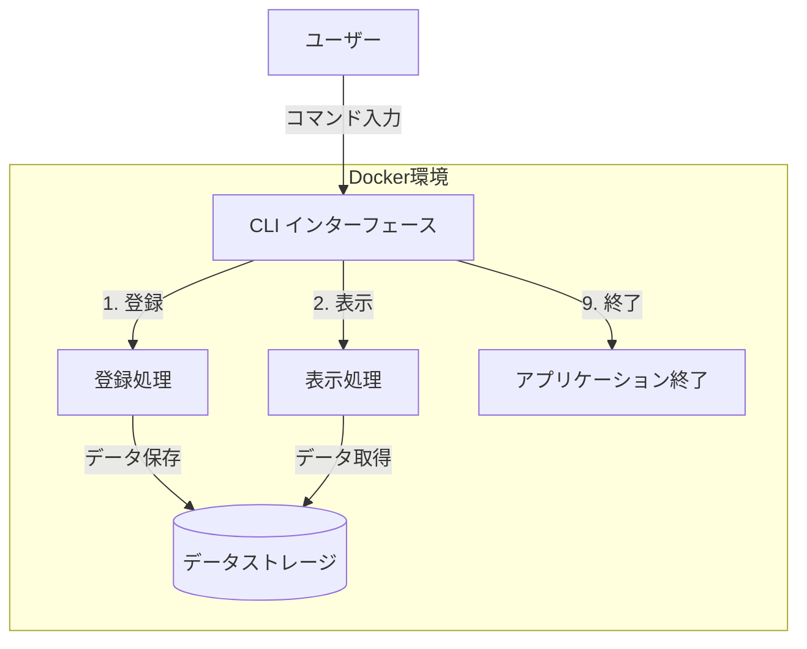

# 読書ログアプリケーション

## 概要

読書ログはコマンドラインインターフェース(CLI)から本の読書記録を管理するPHPアプリケーションです。ユーザーは書籍情報や感想を登録・閲覧することができます。Dockerを使用して簡単に環境構築が可能で、開発環境としても学習環境としても最適なプロジェクトです。

## 特徴

- シンプルなCLIインターフェースによる操作
- Docker/Docker Composeによる簡単な環境構築
- PHP・MySQL・Apacheの連携学習に最適
- 読書記録の登録・表示機能
- Herokuへのデプロイ対応

## このプロジェクトを通して学べること・習得できること

このプロジェクトは以下のスキルや知識を習得するのに最適です：

1. **PHPの基本と実践**
   - PHPの基本構文と制御構造
   - 標準入出力の取り扱い
   - ユーザー入力の処理とバリデーション

2. **データベース連携**
   - MySQLデータベースの設定と接続
   - PDOを使ったデータベース操作
   - CRUD操作の実装方法

3. **Docker技術**
   - コンテナ化の概念理解
   - Docker Composeによる複数サービス管理
   - 開発環境と本番環境の構成差異

4. **Webアプリケーション開発の基礎**
   - MVCアーキテクチャへの拡張可能性
   - セキュリティ対策の実装
   - アプリケーションのライフサイクル管理

5. **クラウドデプロイ**
   - Herokuへのデプロイプロセス
   - 環境変数の活用
   - CI/CDパイプラインの基礎

### アプリケーションの構成図



## 必要条件

- Docker
- Docker Compose
- Git

## インストール手順

1. リポジトリをクローンします

```bash
git clone https://github.com/yourusername/book_log.git
cd book_log
```

2. Dockerコンテナを起動します

```bash
docker-compose up -d
```

3. アプリケーションにアクセスします

```bash
docker-compose exec app php test.php
```

## 使用方法

1. アプリケーションを起動すると、以下のメニューが表示されます
   - 1: 読書ログを登録
   - 2: 読書ログを表示
   - 9: アプリケーションを終了

2. 「1」を選択して読書ログを登録する場合：
   - 書籍名、著者名、読書状況、評価（1〜5点）、感想を入力します
   - 登録完了後、入力した情報が表示されます

3. 「2」を選択すると登録済みの読書ログが表示されます

4. 「9」を選択するとアプリケーションが終了します

## 機能一覧

- 読書ログの登録機能
- 読書ログの表示機能
- シンプルなCLIインターフェース

## 技術スタック

- PHP 7.4
- Apache 2
- MySQL 5.5.62
- Docker / Docker Compose
- Heroku対応設定

## ディレクトリ構造

```
.
├── docker-compose.yml    # Docker Compose設定ファイル
├── Dockerfile            # Herokuデプロイ用Dockerfile
├── README.md             # このファイル
├── docker/               # Docker関連ファイル
│   ├── app/              # PHPアプリケーション設定
│   └── db/               # データベース設定
└── src/                  # ソースコード
    └── test.php          # メインアプリケーション
```

## 今後の開発計画

- データベース連携の実装
- Webインターフェースの追加
- ユーザー認証機能
- 書籍検索API連携

## 貢献方法

1. このリポジトリをフォークします
2. 新しいブランチを作成します (`git checkout -b feature/awesome-feature`)
3. 変更をコミットします (`git commit -m 'Add awesome feature'`)
4. ブランチをプッシュします (`git push origin feature/awesome-feature`)
5. プルリクエストを開きます

## ライセンス

MIT

---

このプロジェクトは読書習慣の管理と、PHPおよびDockerの学習を目的としています。ご質問やフィードバックがありましたら、お気軽にIssueを開いてください。

